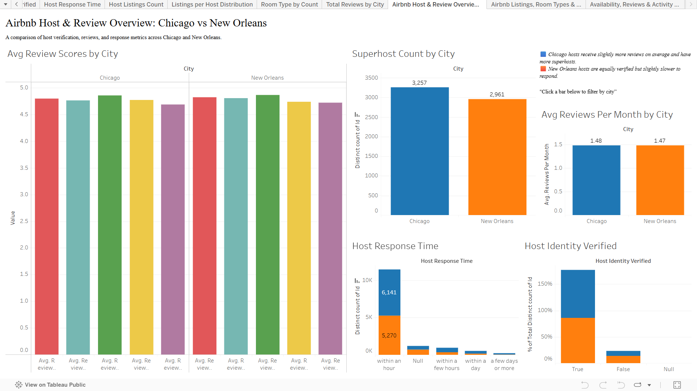
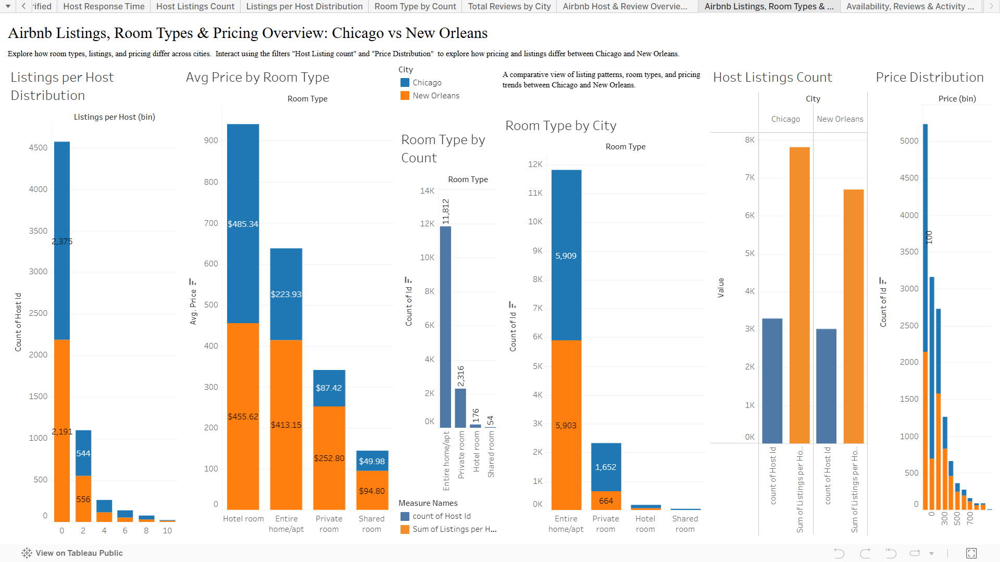
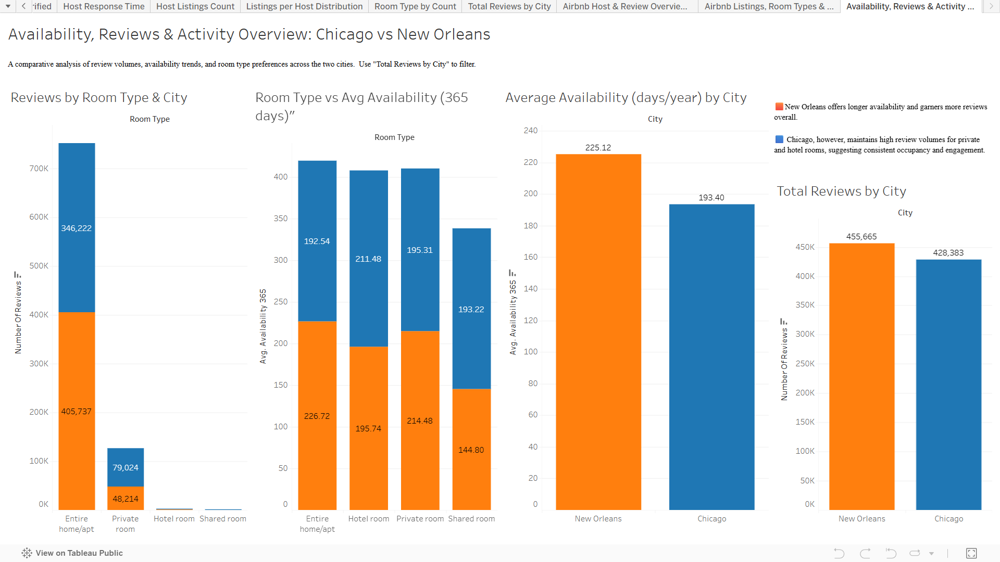

# 🏨 Airbnb Dashboard Project – Chicago vs New Orleans

This project is part of **The DataViz Challenge – Transforming EDA Projects to Dashboards**.

We analyze Airbnb operations in **Chicago** and **New Orleans** through comprehensive **data cleaning**, **exploratory data analysis (EDA)**, and **interactive visual dashboards** built in Tableau. The goal is to uncover trends, patterns, and key insights to support data-driven decisions.

---

## 📊 Live Tableau Dashboard

🔗 [View Interactive Dashboard on Tableau Public](https://public.tableau.com/views/Airbnb_Project_17538033691730/AirbnbHostReviewOverviewChicagovsNewOrleans?:language=en-US&:sid=&:redirect=auth&:display_count=n&:origin=viz_share_link)

---

## 📸 Dashboard Snapshots

Below are the snapshots of the interactive dashboards created in Tableau:

### Dashboard 1: Host & Review Overview


### Dashboard 2: Listings, Room Types & Pricing


### Dashboard 3: Availability, Reviews & Activity


---


## 📌 Problem Statement

> How can Tableau Public be leveraged to perform a comparative analysis of Airbnb operations in **Chicago** and **New Orleans**, two distinct urban markets?

This project uses data visualization to highlight shared attributes, differences, and city-specific trends in Airbnb listings.

---

## 🧾 Dataset Details

- **Source:** [Inside Airbnb](http://insideairbnb.com/get-the-data/)
- **Cities Covered:** Chicago & New Orleans
- **Key Files:**
  - `chicago_airbnb_cleaned.csv`
  - `new_orleans_airbnb_cleaned.csv`
- **Notable Fields:** `id`, `host_id`, `neighbourhood`, `room_type`, `price`, `reviews_per_month`, `availability_365`, and more.

---

## 🛠️ Tools & Technologies

- **Jupyter Notebook** – Data cleaning & transformation  
- **Pandas, NumPy** – Data manipulation  
- **Matplotlib, Seaborn** – EDA visualizations  
- **Tableau Public** – Dashboard development

---

## 🚀 Project Workflow

### ✅ Phase 1: Data Cleaning & Transformation
- Removed duplicates, handled nulls, standardized text formatting
- Created new columns like `Listings per Host`, `Price per Bedroom`
- Standardized neighborhood values using Tableau Prep’s “Group & Replace”

### ✅ Phase 2: Exploratory Data Analysis & Visualization
Grouped into four major themes:
1. **Overview of Airbnb Listings**
2. **Property Analysis**
3. **Pricing Analysis**
4. **Host Behavior & Reviews**

### ✅ Phase 3: Dashboard Design
- **Dashboard 1:** Host & Review Overview  
- **Dashboard 2:** Listings & Pricing Insights  
- **Dashboard 3:** Availability, Reviews & Activity

All dashboards include filters, city-wise comparisons, and responsive interactivity.

---

## 💡 Key Insights

- **Entire home/apt** is the most popular room type in both cities  
- **Chicago** has more superhosts and higher host responsiveness  
- **New Orleans** listings are available for more days on average  
- Private rooms are more affordable but receive fewer reviews  
- Availability and price do not always correlate with reviews

---

## 📁 Repository Structure

```bash
airbnb-dashboard-project/
├── data/
│   ├── chicago_airbnb_cleaned.csv
│   └── new_orleans_airbnb_cleaned.csv
├── dashboards/
│   ├── dashboard_1.png
│   ├── dashboard_2.png
│   └── dashboard_3.png
├── Airbnb_EDA.ipynb
└── README.md
```
## 👨‍💻 Author
---
**Muhammad Hammaad Haque**  
📧 Email: mhhaque90@gmail.com  
🔗 [Tableau Public Profile] (https://public.tableau.com/app/profile/muhammad.hammaad.haque)  
🔗 [LinkedIn_Profile] (https://www.linkedin.com/in/muhammad-hammaad-haque/)  
---

## 🙏 Acknowledgement

This project was completed as part of the [**AlmaBetter**](https://www.almabetter.com/) Full Stack Data Science Program under the **EDA to Dashboard Capstone Challenge**.  
Special thanks to **AlmaBetter** for providing the guidance, resources, and community support that helped shape this project into a practical and insightful data visualization case study.
